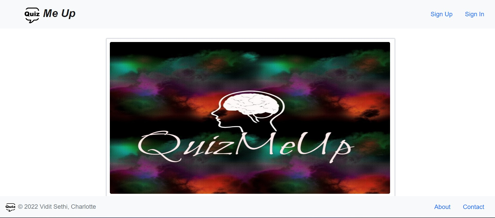
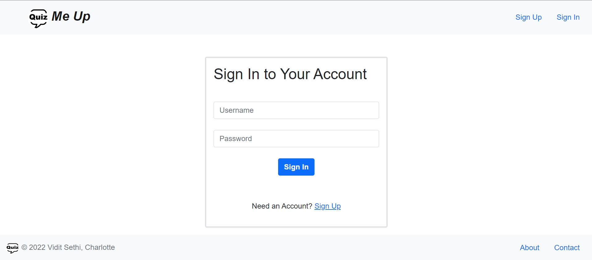
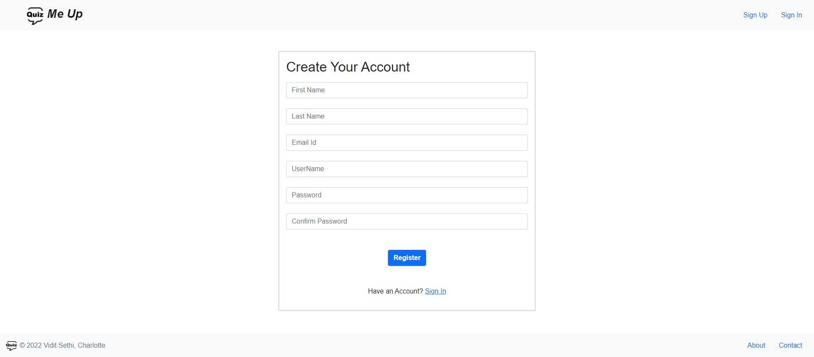
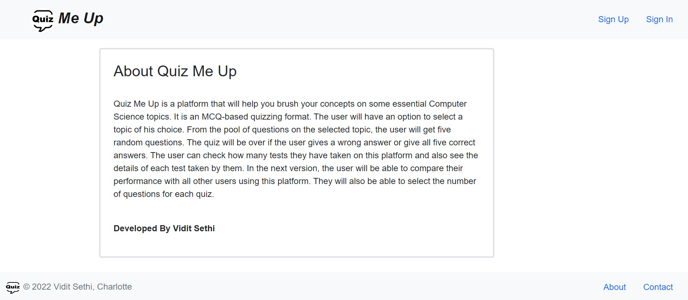
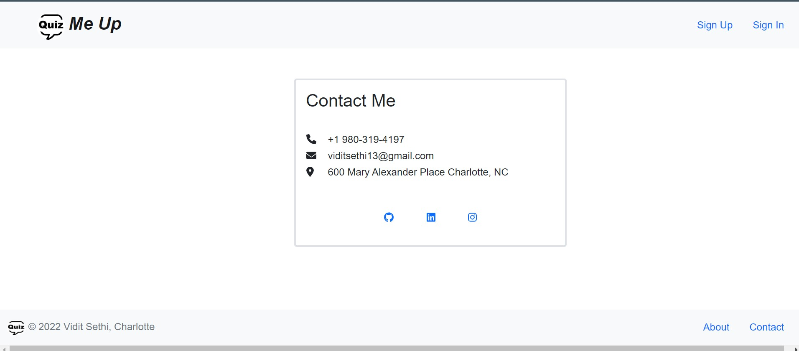
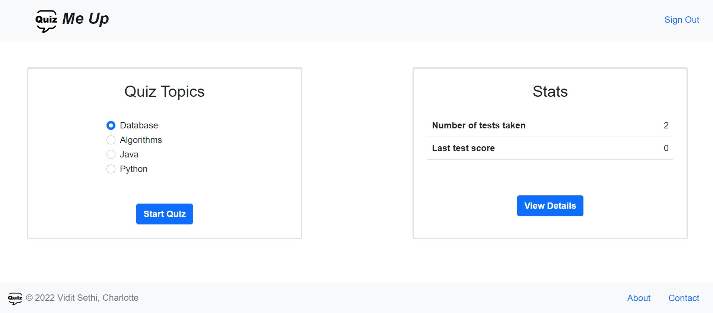
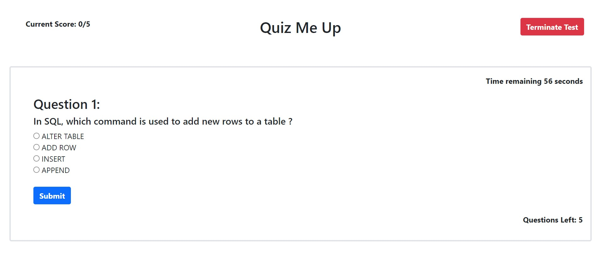
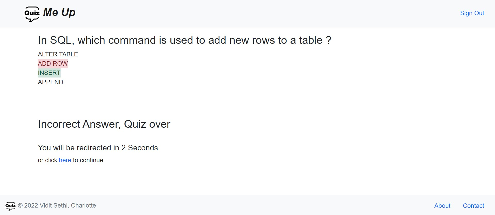
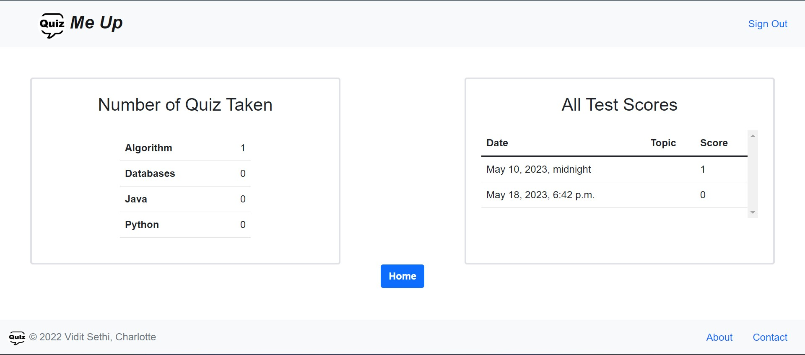

<h1> Quiz me up </h1>

  
 Quiz Me Up is a web-based quizzing platform that is designed to provide users with an interactive and engaging experience for taking quizzes. The platform offers a wide range of categories, each containing randomized questions. Users are required to create an account in order to access and take tests.

  
 Once logged in, users can select a specific category or choose a mixed category to have questions from various topics. The platform randomly selects a set of questions from the selected category and presents them to the user. The questions may be multiple-choice, true/false, or in any other format depending on the quiz configuration.

  
 After completing the quiz, users receive an instant result displaying their score and the correct answers for the questions they answered incorrectly. Additionally, users can access a detailed analysis of their test results, providing insights such as the percentage of correct answers, time taken, and overall performance.

  
 The platform also allows users to view their previous test scores, providing a history of their performance over time. This feature enables users to track their progress, identify areas for improvement, and compare their scores across different quizzes.

  
 Overall, Quiz Me Up offers a convenient and user-friendly way for individuals to test their knowledge in various subjects, track their progress, and engage in continuous learning.

<h2> Running the project </h2>
  To access and run this Django project, please visit http://viditsethi13.pythonanywhere.com/.  
  This URL will direct you to the live deployment of the project where you can interact with the application and explore its features.

<h2> Usage </h2>
  
To use the web-based quizzing platform, follow these steps:

    <ul>
      <li>Create a new account or log in with your existing account.</li>
      <li>From the home page, you have the option to start a new quiz or view your quiz results.</li>
      <li>Each question in the quiz will have a time limit of 60 seconds for you to answer.</li>
      <li>Once you submit your answer or the allotted time for the question is finished, you will be able to see the correct answer.</li>
      <li>If you give a wrong answer, the quiz will terminate.</li>
      <li>Each quiz consists of 5 questions.</li>
    </ul>

<h2> Screenshots </h2>
  Home
  
  Sign In
  
  Sign Up
  
  About
  
  Contact
  
  Account Home
  
  Question
  
  Solution
  
  Stats
  

<h2> Architecture </h2>
  
 This Django project follows the Model-View-Template (MVT) architectural pattern. The components are organized as follows:

  <ul>
    <li><b>Model:</b> The models defined in the project represent the data structure and handle interactions with the database. They are implemented as Python classes that      inherit from the django.db.models.Model base class.</li>
    <li><b>View:</b> Views handle request processing, business logic, and data retrieval. They receive HTTP requests and return HTTP responses. Views interact with models    to fetch or manipulate data and pass it to templates for rendering.</li>
    <li><b>Template:</b> Templates define the presentation layer of the application. They are HTML files with embedded Django template language (DTL) tags and filters. Templates receive data from views and render it to produce the final output.</li>
  </ul>
  This separation of concerns allows for a clear and modular development approach, making it easier to manage the different aspects of the application and promote code reusability. 

<h2> Contributing </h2>
  
 Contributions are welcome! If you would like to contribute to this project, please reach out to me via email at viditsethi13@gmail.com.

  Please include the following information in your email:
  <ul>
    <li>Your name </li>
    <li>Your area of expertise or interest </li>
    <li>How you would like to contribute to the project </li>
  </ul>
  I will get back to you as soon as possible with further details on how you can get involved. Thank you for your interest and willingness to contribute!  
  Feel free to modify the email address and instructions to suit your specific needs.

<h2> Contact </h2>
  If you have any questions or comments about the App, please contact me at viditsethi13@gmail.com.
